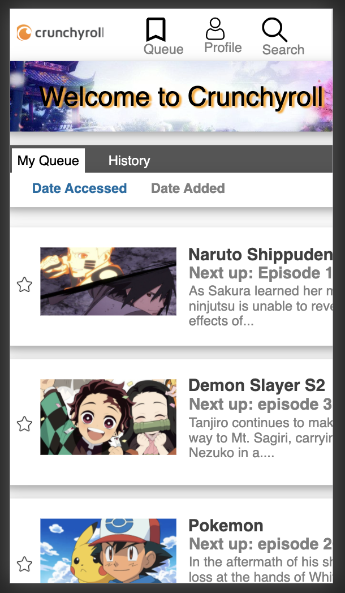
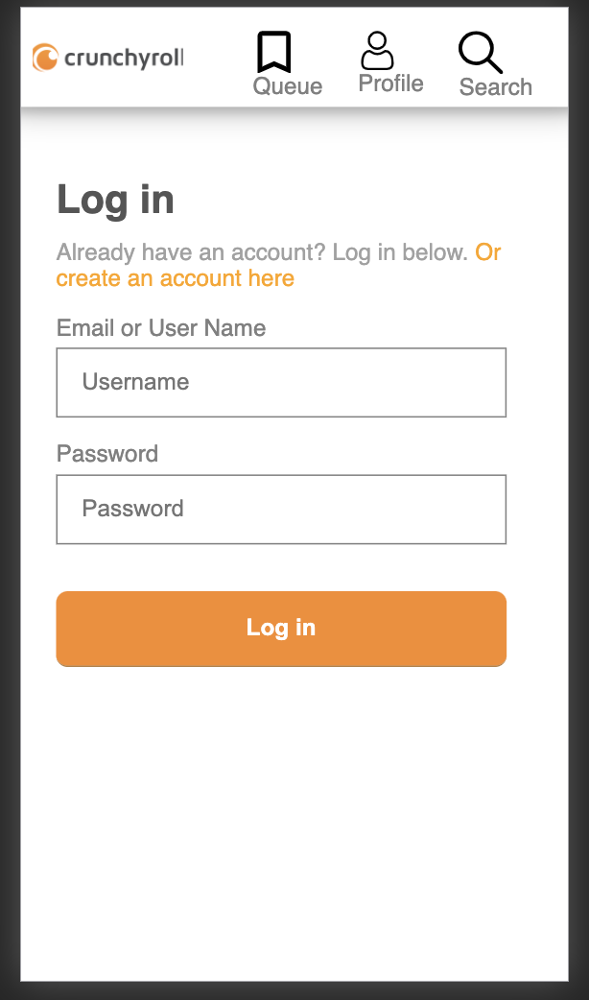
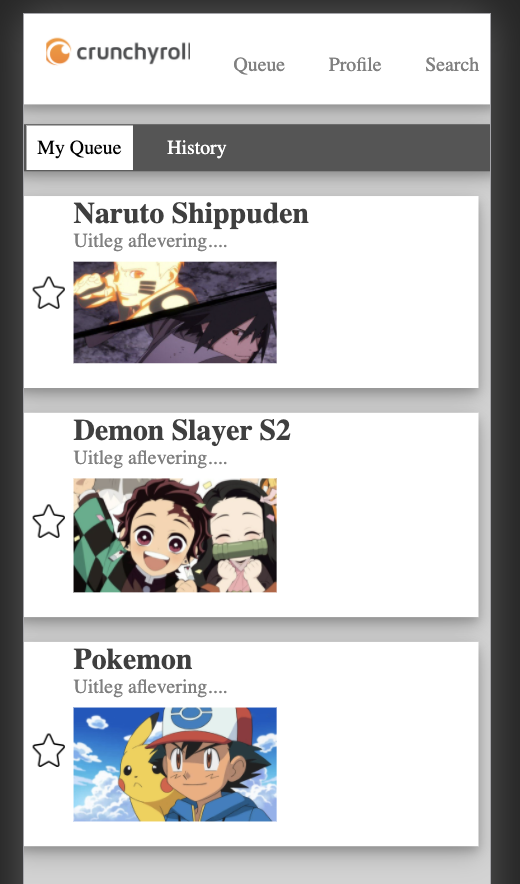
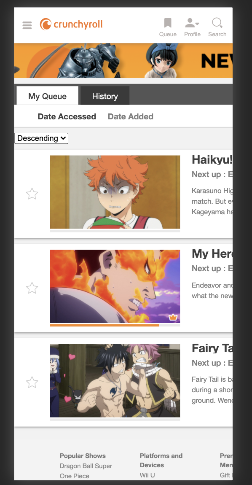
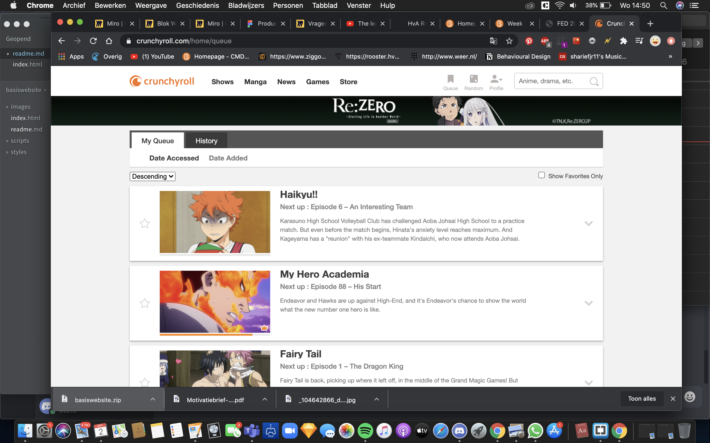
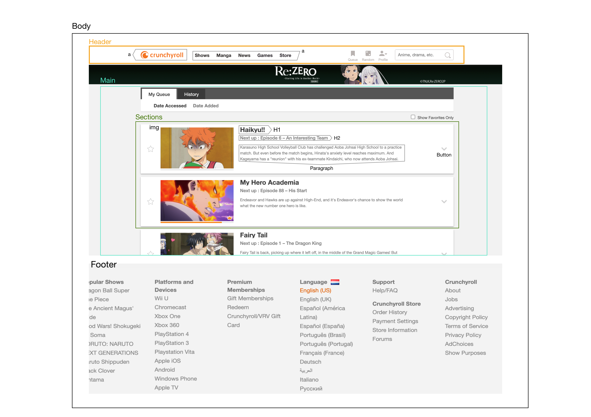

# Procesverslag
**Auteur:** -Sharief Toussaint-

Markdown cheat cheet: [Hulp bij het schrijven van Markdown](https://github.com/adam-p/markdown-here/wiki/Markdown-Cheatsheet). Nb. de standaardstructuur en de spartaanse opmaak zijn helemaal prima. Het gaat om de inhoud van je procesverslag. Besteedt de tijd voor pracht en praal aan je website.

## Bronnenlijst
1. -Mijn eigen werk van het eerste leerjaar voor het toepassen van JS-
2. -De website van crunchyroll zelf voor het inspecteren-
3. -Meerdere sites bezocht via google om mij op weg te helpen.-

## Eindgesprek (week 7/8)

Wat ging goed: 
Mijn eindresultaat. Voor mijn gevoel is dit goed gelukt om de webpagina van crunchyroll zo goed mogelijk te coderen. Ik heb hier ook nog een 2e pagina aan toegevoegd, de inlogpagina. Als laatst ben ik wezen kijken naar JS handelingen die van toepassing kunnen zijn op mijn website:

Dit was lastig: 
Vanwege tijdnood heb ik helaas niet kunnen doen wat ik precies in gedachte had. Mijn inlogpagina wilde ik de button pas zichtbaar maken als er een value is ingevuld in beide inputs. Ik heb voor elke ster binnen mijn artikel aparte classes gemaakt en deze apart aangestuurd in mijn JS. Met de queryselector code kreeg ik het niet voor elkaar om ze allemaal binnen 1 klas te selecteren.

-screenshot(s) van je eindresultaat-

## Voortgang 3 (week 6)

Helaas was ik niet ver genoeg en had ik het druk met andere vakken om hier mijn voortgang te laten zien.
Ik ben dus gebleven waar ik was tijdens het vorige gesprek....

## Voortgang 2 (week 5)

Bij mijn 2e gesprek heb ik mijn gehele 1e pagina af kunne krijgen. CSS is goed gelukt om de stijl van we originele website te gebruiken. Alleen moest ik nog nadenken over een 2e pagina en het toevoegen van javascript:

-screenshot(s) van hoe ver je bent

## Voortgang 1 (week 3)

### Stand van zaken

-dit ging goed & dit was lastig-
De oefeningen van codepen die we als huiswerk mee hebben gekregen tijdens de werkcolleges, hebben mij zeker goed op weg kunnen helpen. 
Die flexbox oefeningen, het maken van een header is nodig in mijn website en daar kon ik al meteen mee aan de slag. 

Wat ik nog lastig vond is het aanmaken van een main, met daarin een section en dan nog een keuze maken uit een article. De content die ik wil plaatsen in mijn article is wel gelukt, alleen niet op de exacte manier, hier heb ik gewoon nog meer tijd voor nodig en moet ik nog beter mee experimenteren. 

**Screenshot(s):**

-screenshot(s) van hoe ver je bent
)

-screenshot(s) van hoe ver je bent

### Agenda voor meeting

-samen met je groepje opstellen-

### Verslag van meeting

-na afloop snel uitkomsten vastleggen-

## Intake (week 1)

**Je startniveau:** -ik geef mezelf hier de rode kleur -

**Je focus:** -ik ga hier focussen op de surface plane-

**Je opdracht:** -https://www.crunchyroll.com/home/queue

**Screenshot(s):**

**Breakdown-schets(en):**

